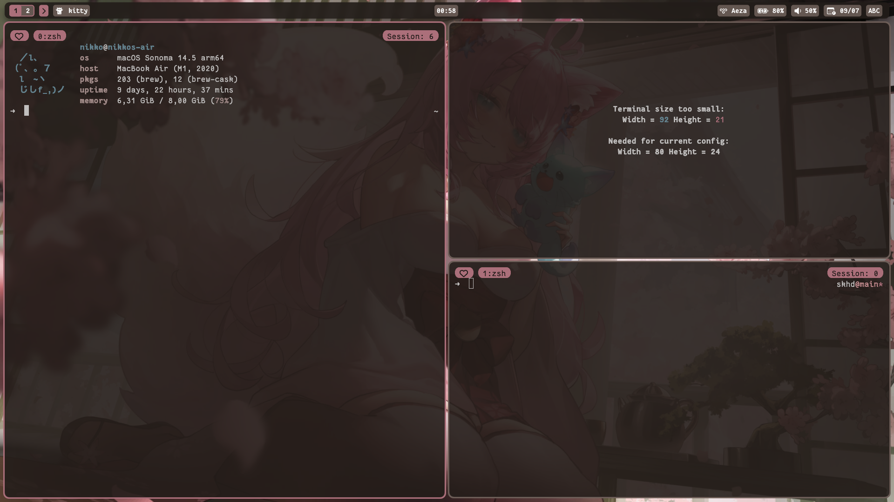

# dotfiles
My macOS dotfiles /ᐠ - ⩊ -マ Ⳋ



## Requirements
- grep
- imagemagick
- gcc-14
- fantasquesansm nerd font
- fd is optional
- something else probably

## Generating colorschemes
You can use my custom function:
```bash
fwal path/to/your/image.png
```
This will:
- generate a colorscheme using [pywal16](https://github.com/eylles/pywal16)
- automatically reload everything except neovim, spicetify and discord
- automatically apply the wallpaper

To reload spicetify, either do:
```bash
spicetify apply
```
or run spicetify with automatic reloading enabled:
```bash
spicetify watch -s
```

## Applying the wallpaper
If your wallpaper doesn't apply automatically,
enable System Preferences > Wallpaper > Show on all Spaces


## TODOs
- [ ] Add an install script
- [ ] Make some better keymaps for skhd
